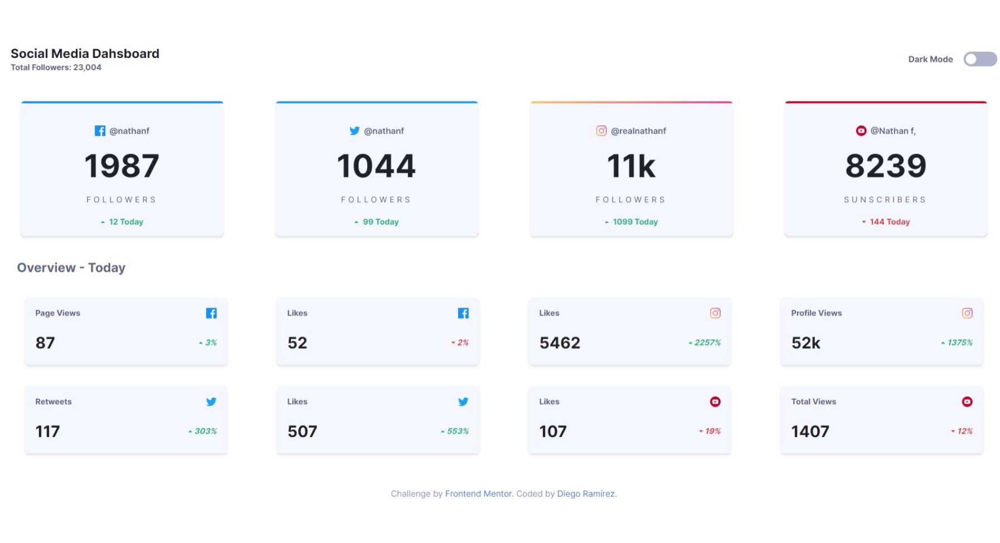

# Frontend Mentor - Social media dashboard with theme switcher solution

This is a solution to the [Social media dashboard with theme switcher challenge on Frontend Mentor](https://www.frontendmentor.io/challenges/social-media-dashboard-with-theme-switcher-6oY8ozp_H). Frontend Mentor challenges help you improve your coding skills by building realistic projects. 

## Table of contents

- [Overview](#overview)
  - [The challenge](#the-challenge)
  - [Screenshot](#screenshot)
  - [Links](#links)
- [My process](#my-process)
  - [Built with](#built-with)
  - [What I learned](#what-i-learned)
  - [Useful resources](#useful-resources)
- [Author](#author)


## Overview

### The challenge

Users should be able to:

- View the optimal layout for the site depending on their device's screen size
- See hover states for all interactive elements on the page
- Toggle color theme to their preference

### Screenshot



### Links

- Solution URL: [Add solution URL here](https://github.com/Diego2Drm/social-media-theme-switcher)
- Live Site URL: [Add live site URL here](https://your-live-site-url.com)

## My process

### Built with

- Semantic HTML5 markup
- CSS custom properties
- Flexbox
- CSS Grid
- Mobile-first workflow
- [React](https://reactjs.org/) - JS library
- Tailwind CSS

### What I learned

I learned how to use Tailwind CSS dark mode and how to implement it in Reac Js.


```tailwind.config.js
  "darkMode: 'selector',"
```
```jsx
const [ theme, setTheme ] = useState("light");
  useEffect(() => {
    if(theme == "dark"){
      document.querySelector('html').classList.add("dark");
    } else{
      document.querySelector('html').classList.remove("dark");
    }
  },[theme]);

  const handleChange = () => {
    setTheme(prevTheme => prevTheme == "light" ? "dark" : "light")
  }

 <input type="checkbox" className="appearance-none" onClick={handleChange}/>

```

### Useful resources

- [Tailwind CSS](https://tailwindcss.com/docs/guides/vite) - This helped me Install Tailwind CSS in React + Vite.
- [ React + Vite](https://vitejs.dev/guide/) - This helped me Install React + Vite.

## Author

- Frontend Mentor - [@Diego2Drm](https://www.frontendmentor.io/profile/Diego2Drm)

